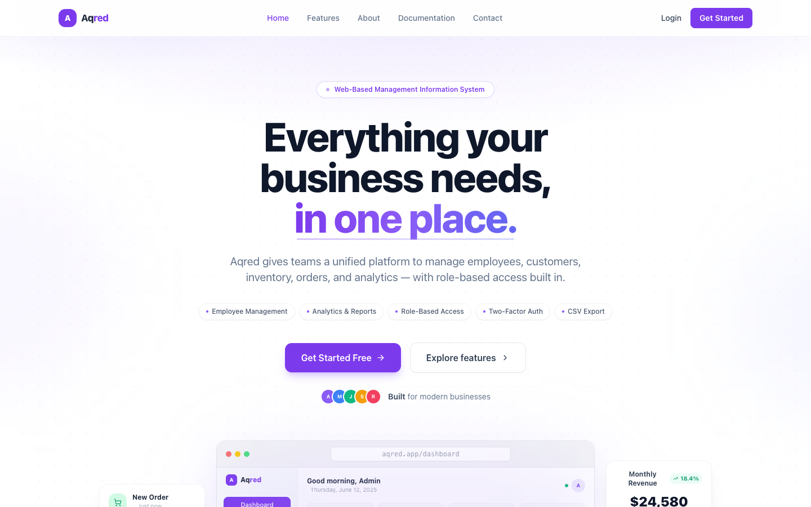
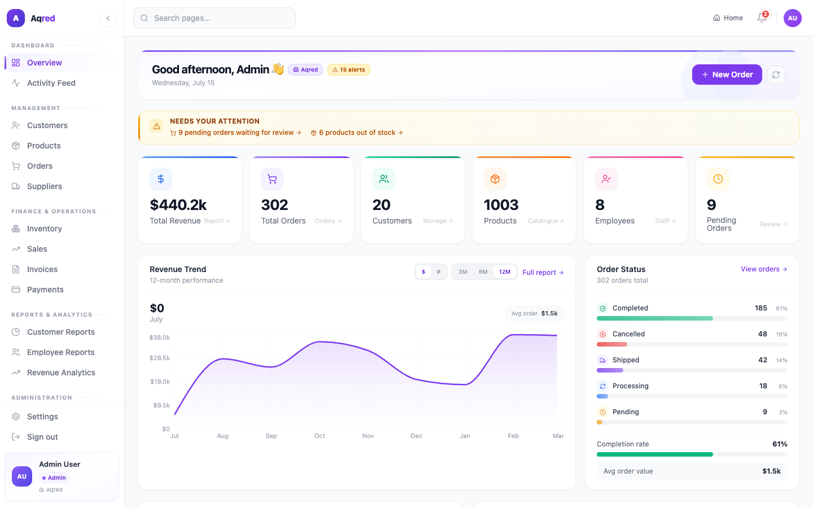
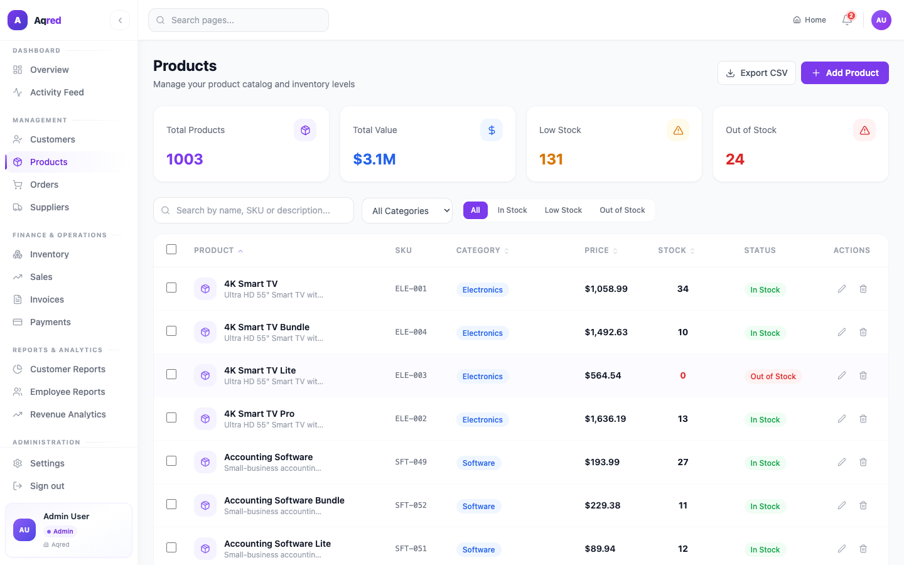
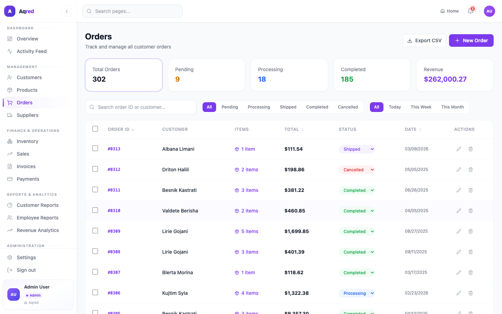
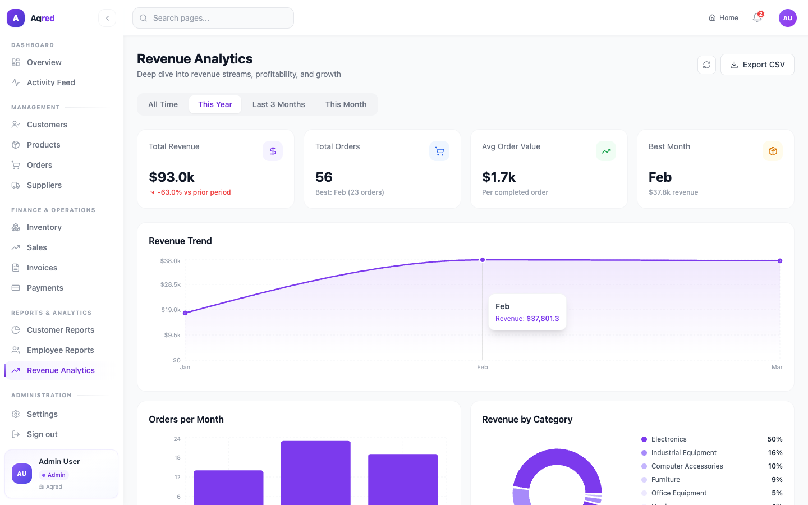

# Aqred MIS

A full-stack Management Information System for tracking staff, inventory, customers, orders, sales, and revenue.

## Screenshots



| Dashboard | Products |
|---|---|
|  |  |

| Orders | Revenue Analytics |
|---|---|
|  |  |

## Tech Stack

**Frontend:** React 19, React Router DOM v7, Tailwind CSS v3, Recharts, Lucide React
**Backend:** Node.js, Express v5, PostgreSQL (`pg`), JWT auth, bcrypt, Speakeasy (TOTP 2FA)

## Features

- **Authentication & RBAC** — JWT-based login with `admin`, `manager`, `employee`, and `super_admin` roles, each with scoped access to different modules
- **Two-factor authentication** — TOTP setup/verify/disable via an authenticator app
- **Business operations** — staff, customers, products, suppliers, orders, and inventory management
- **Sales & reporting** — revenue analytics, customer/employee reports, exportable CSV data
- **Command palette** — Cmd/Ctrl+K to jump to any page or run a quick action from the keyboard
- **Multi-company support** — data is scoped per company, with a platform-level `super_admin` role that can create, suspend, or permanently remove companies
- **Platform administration** — company management, role & permission editing, a real audit log (`system_logs`) covering both company- and platform-level actions, and a platform-wide maintenance mode
- **Public contact form** — submissions are stored and reviewable from a super-admin inbox, not just a form that goes nowhere
- **Dark mode** — throughout the entire app, not just the marketing pages

## Prerequisites

- Node.js 18+
- PostgreSQL 14+ running locally

## Setup

### 1. Clone and install dependencies

```bash
git clone https://github.com/driolaveseli/aqred-mis.git
cd aqred-mis

cd backend && npm install
cd ../frontend && npm install
```

### 2. Configure the database

Create a local database:

```bash
createdb mis_db
```

### 3. Configure environment variables

```bash
cd backend
cp .env.example .env
```

Edit `backend/.env` and fill in your own values — at minimum `DB_PASSWORD` (your local Postgres password) and `JWT_SECRET` (generate one with the command in the example file). SMTP settings are optional; without them, password-reset tokens are logged to the console instead of emailed.

### 4. Run the backend

```bash
cd backend
npm run dev
```

This runs database migrations automatically on startup and starts the API at `http://localhost:5000`. On a fresh database, migrations auto-seed two accounts:

- **Company admin** (full access to Dashboard, Business Operations, Reports, Administration): `admin@aqred.com` / `admin123`
- **Platform super-admin** (manages companies across the platform, at `/super-admin/companies`): `superadmin@aqred.com` / `superadmin123`

Log in at `http://localhost:3000/login` with either.

Optional: seed sample data for a fuller demo:

```bash
node scripts/seedProducts.js
node scripts/seedOrders.js
```

### 5. Run the frontend

```bash
cd frontend
npm start
```

The app runs at `http://localhost:3000` and talks to the API at `http://localhost:5000/api`.

## Running Tests

```bash
cd backend && npm test
cd frontend && npm test
```

## Project Structure

```
backend/
  config/       # DB pool, JWT secret, migrations
  controllers/  # Route handlers / business logic
  middleware/   # Auth, RBAC, maintenance mode
  models/       # Data-access layer
  routes/       # Express route definitions
  scripts/      # One-off admin/seed scripts
  __tests__/    # Backend tests

frontend/
  src/
    components/ # Reusable UI components
    context/    # Auth & system-wide React context
    layouts/    # Page shells (dashboard layout, etc.)
    pages/      # Route-level views
    services/   # Axios API wrappers
    utils/      # Helpers (CSV export, etc.)
```

## License

MIT — see [LICENSE](LICENSE).
